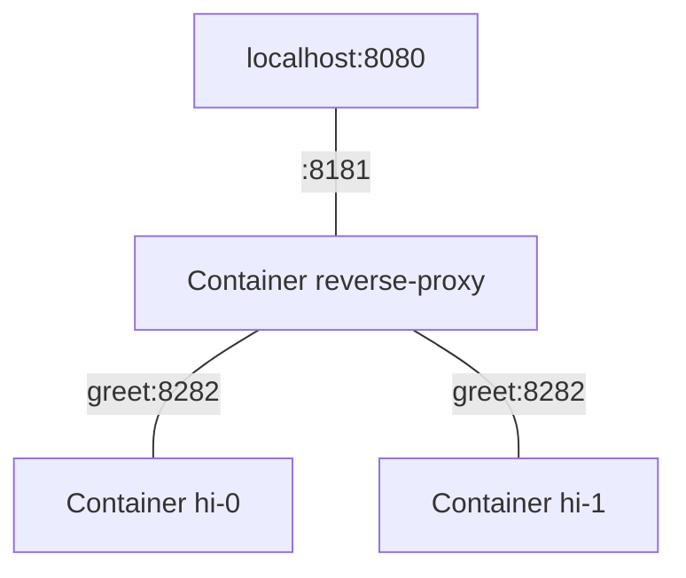

# Zero-downtime deployments with Podman (or Docker)

The motivation is to deploy an updated version of a container without service
interruption. We want to keep things light and only use rootless Podman.

This works with Docker, too, just replace `podman` by `docker` in the commands
below.

## Overview

Say we want to replace a service container `hi-0` by `hi-1`. To keep the service
always available during such a deployment, a reverse proxy forwards traffic to
the service container(s) via their identical domain name `greet`:



At any given time, at least one service container is available by making sure
their lifetimes overlap:

```
____________________________________
Container hi-0                      Stop
                        ____________________________________
                        Start                 Container hi-1

                        ^^^^^^^^^^^^
                        Overlap
```

## Demo

The following shows how to do such a deployment interactively.

1. First, for the containers to reach each other, set up a **network** with

   ```bash
   podman network create test-net
   ```

1. Run the **reverse proxy** on this network with

   ```bash
   podman run --detach --name reverse-proxy --network test-net \
     --publish 127.0.0.1:8080:8181 \
     docker.io/caddy:2 caddy reverse-proxy --from :8181 --to greet:8282
   ```

   This Caddy instance forwards traffic from port 8080 on localhost to the
   domain name `greet` in the container network (port 8282).

1. **Start version A** of your service with

   ```bash
   podman run --detach --name hi-0 --network test-net --network-alias greet \
     docker.io/hashicorp/http-echo:1.0 -listen=:8282 -text='Hi from A'
   ```

   This container simply responds with a greeting on requests.

   Crucially, we give it a network alias `greet`, which the reverse proxy can
   then resolve.

   Test it: `curl localhost:8080` returns "Hi from _A_" now.

   To see the following update in action, you could keep a test loop running in
   a separate shell session with

   ```bash
   while true; do curl --fail --max-time 0.2 localhost:8080; sleep 0.01s; done
   ```

1. **Start version B** of your service with

   ```bash
   podman run --detach --name hi-1 --network test-net --network-alias greet \
     docker.io/hashicorp/http-echo:1.0 -listen=:8282 -text='Hi from B'
   ```

   At this point, both service versions are running at the same time with the
   same network alias.

   Thus, the domain name `greet` resolves to _two_ IP addresses in the container
   network, which you can check with a DNS query like

   ```bash
   podman run --network test-net --rm docker.io/alpine nslookup greet
   ```

1. **Stop version A** of your service with

   ```bash
   podman stop hi-0
   ```

   With that, the update is done.

   Test it: `curl localhost:8080` returns "Hi from _B_" now.

You can tear down the demo resources with

```bash
podman rm --force hi-0 hi-1 reverse-proxy
podman network rm test-net
```

Run the whole demo automatically with the script `scripts/demo.sh`.

## Docker Compose

For a more automatic, declarative workflow, above can be achieved in Compose
with the support of [Kerek](https://github.com/evolutics/kerek).

The Compose file for the demo is this:

```yaml
# compose.yaml
services:
  greet:
    command: ["-listen=:8282", "-text=Hi from A/B"]
    deploy:
      update_config:
        order: start-first
    image: "docker.io/hashicorp/http-echo:1.0"

  reverse-proxy:
    command: ["caddy", "reverse-proxy", "--from", ":8181", "--to", "greet:8282"]
    image: "docker.io/caddy:2"
    ports:
      - "127.0.0.1:8080:8181"
```

Then simply run `kerek deploy`, which works like `docker compose up` but
respects the configured update order. In this case, a new container of the
`greet` service is started before the old container is stopped, resulting in the
desired overlap of their lifetimes.

## Tested reverse proxies

These reverse proxies have been tested:

- Caddy
- HAProxy ([config](haproxy/haproxy.cfg))

See the [demo code](scripts/demo.sh) for an example each.

## Known issues

If possible, use the very latest Podman version as earlier versions may not pass
above demo; Podman 5.2.3 for instance has shown intermittent DNS issues.
